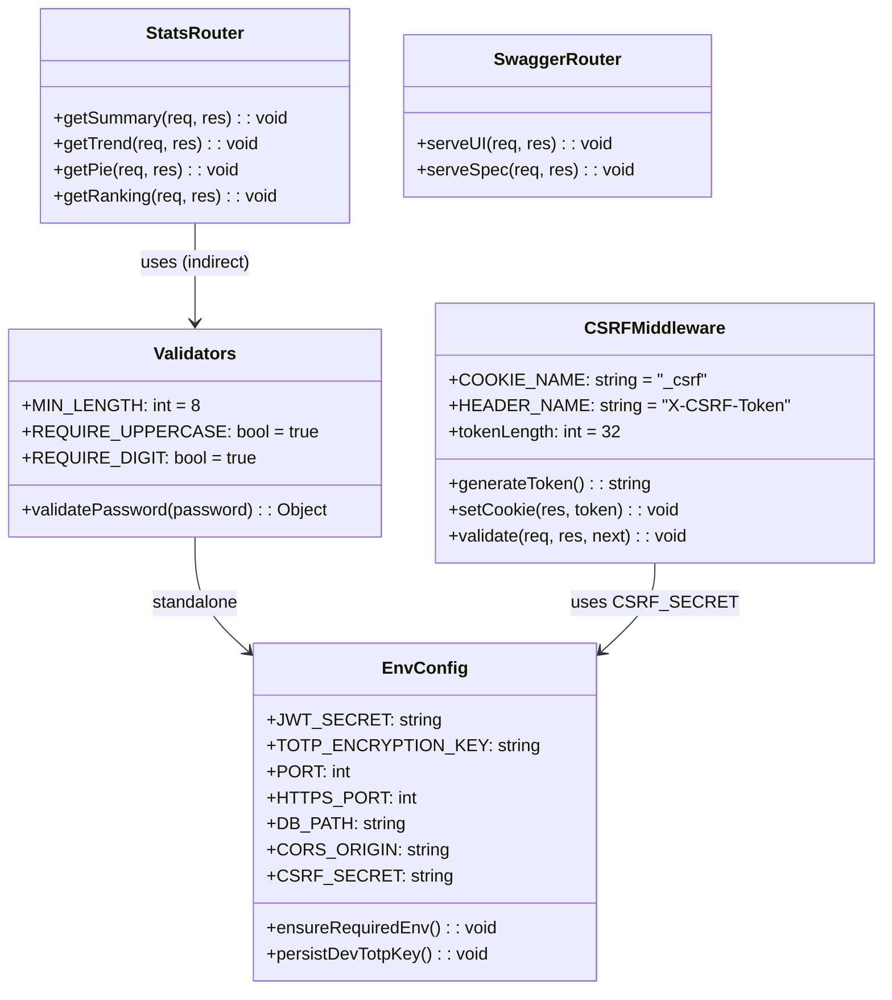
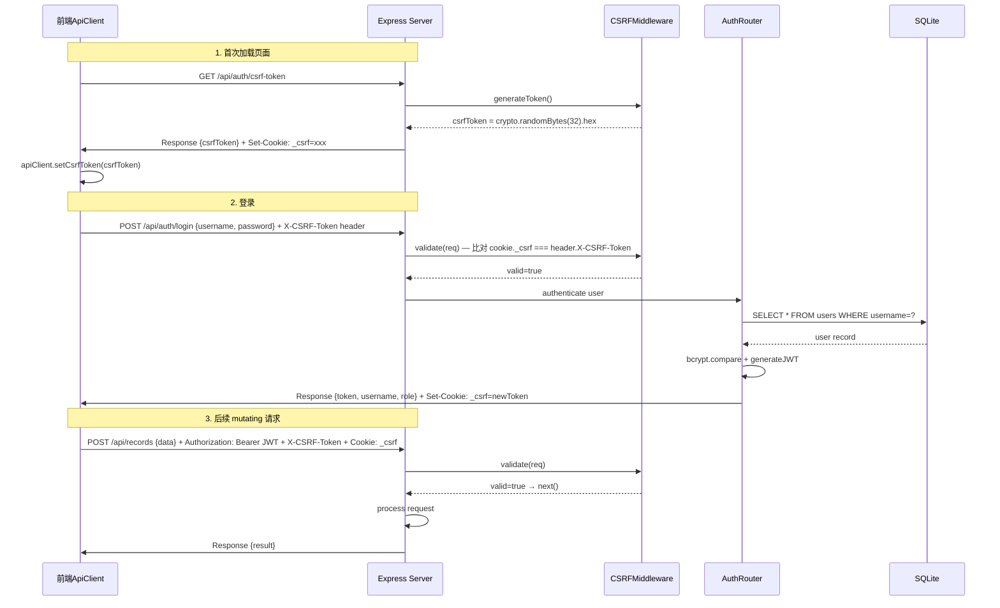
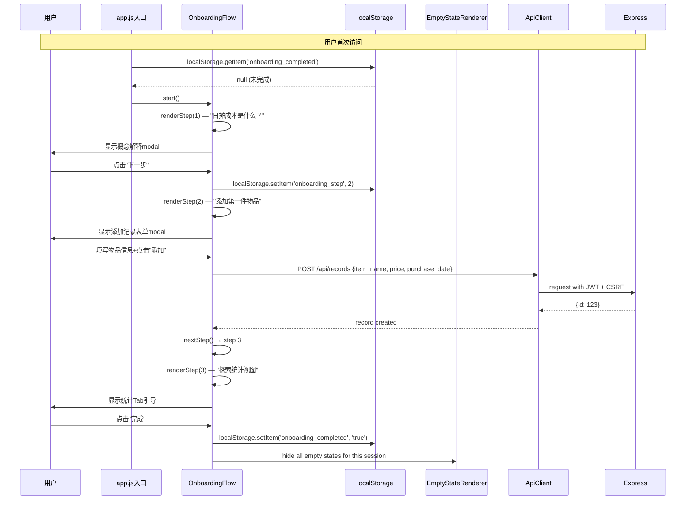
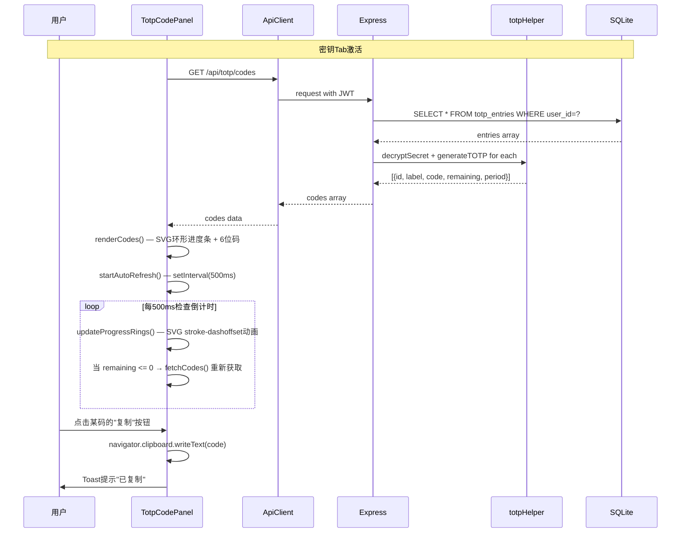
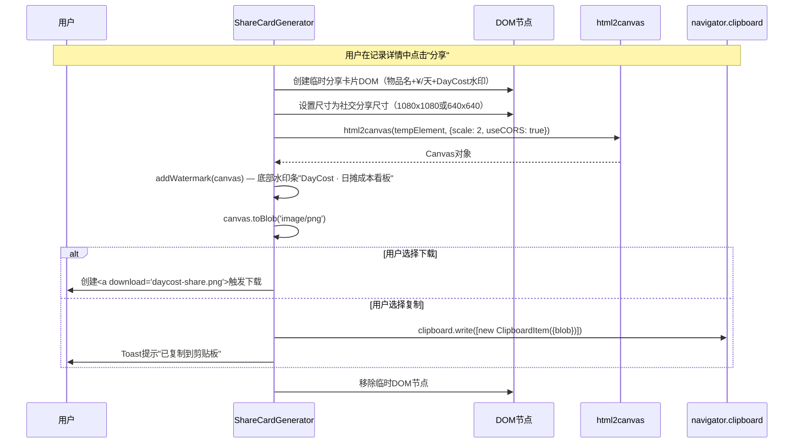
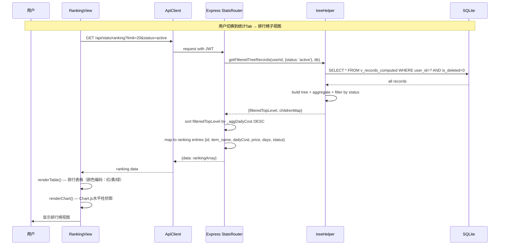
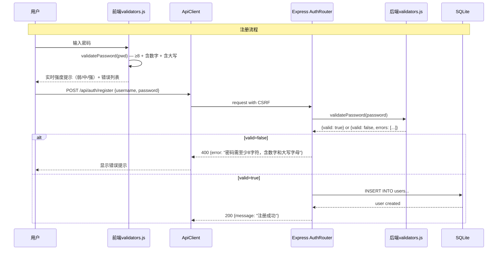
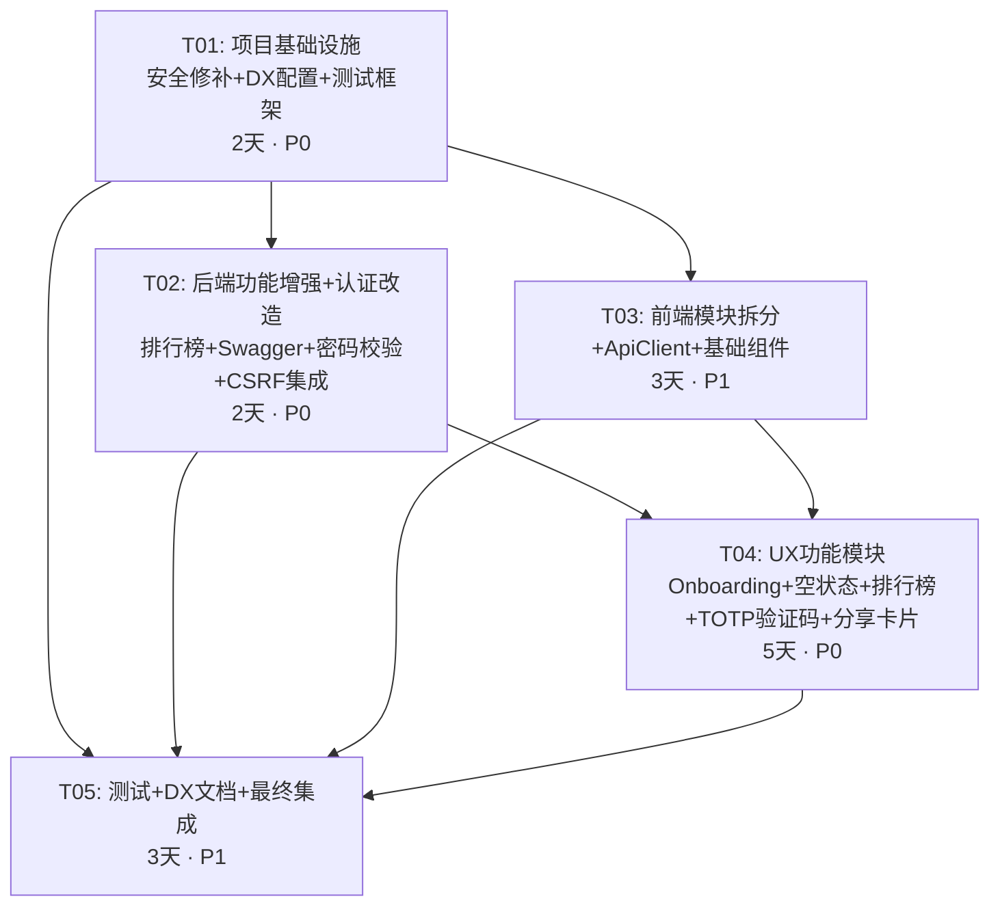

# DayCost v1.1 系统架构设计

> 架构师：高见远（Gao）
> 日期：2026-06-26
> 版本：v1.1
> 基于产品审视报告（许清楚 · v1.0.0）

---

## 目录

- [Part A: 系统设计](#part-a-系统设计)
  - [1. 实现方案与框架选型](#1-实现方案与框架选型)
  - [2. 文件列表及相对路径](#2-文件列表及相对路径)
  - [3. 数据结构和接口](#3-数据结构和接口)
  - [4. 程序调用流程](#4-程序调用流程)
  - [5. 待明确事项](#5-待明确事项)
- [Part B: 任务拆分](#part-b-任务拆分)
  - [6. 依赖包列表](#6-依赖包列表)
  - [7. 任务列表](#7-任务列表)
  - [8. 共享知识](#8-共享知识)
  - [9. 任务依赖图](#9-任务依赖图)

---

## Part A: 系统设计

### 1. 实现方案与框架选型

#### 1.1 核心技术挑战分析

| 挑战 | 说明 | 对应审视项 |
|------|------|-----------|
| **安全底线修补** | JWT硬编码、CSRF缺失、密码弱校验、TOTP_KEY不持久化——4项安全P0是v1.1底线 | P0#6-9 |
| **前端巨石拆分** | script.js 2347行无法增量开发，但拆分不能阻塞功能交付 | P1#2 |
| **TOTP实时验证码** | 需30s定时刷新+环形进度条+多密钥并发，前端定时器管理复杂 | P0#4 |
| **分享卡片生成** | 纯前端Canvas绘制+品牌水印+社交尺寸适配，无后端参与 | P0#5 |
| **新手引导Onboarding** | 3步流程需状态持久化（localStorage），且与空状态设计联动 | P0#1 |
| **日成本排行榜** | 后端新增排序接口，前端新视图tab，需与现有stats模块对接 | P0#3 |
| **空状态设计** | 每个Tab需独立插画+文案+CTA，需统一空状态组件模式 | P0#2 |

#### 1.2 框架与库选型

| 类别 | 选型 | 理由 |
|------|------|------|
| **前端架构** | **保持 Vanilla JS + ES Module** | v1.1明确不做框架迁移；用 `<script type="module">` + import/export 拆分巨石，最小变更 |
| **CSS架构** | **扩展现有 design-system.css + 按视图拆分CSS文件** | 已有Token层基础，v1.1补充Component层+按视图拆文件，不做Tailwind迁移 |
| **图表** | **保持 Chart.js**（现有 chart.min.js） | v1.1仅新增排行榜视图（柱状图），Chart.js已有；不引入新图表库 |
| **CSRF防护** | **cookie-csrf（Double Submit Cookie模式）** | 轻量、无额外依赖、兼容SPA+JWT模式；比HttpOnly Cookie改造改动更小 |
| **密码校验** | **自定义 validator 函数** | 不引入zod/joi等重库，8字符+数字+大写3条规则足够，放 `src/utils/validators.js` |
| **TOTP定时刷新** | **前端 setInterval + requestAnimationFrame** | 不引入rxjs等响应式库；TOTP倒计时30s周期短，原生定时器即可 |
| **分享卡片** | **html2canvas** | 轻量（~40KB）、纯前端DOM→Canvas→PNG，无需后端参与；比Canvas手绘更灵活 |
| **测试框架** | **vitest** | Vite生态原生测试框架、ESM友好、零配置、比Jest更适合Node.js+SQLite项目 |
| **Lint/Format** | **ESLint（已有）+ Prettier + Husky + lint-staged** | ESLint已有配置；补充Prettier统一格式，Husky自动化pre-commit |
| **API文档** | **swagger-jsdoc + swagger-ui-express** | 从Express路由JSDoc注释自动生成OpenAPI spec，无需手写YAML |
| **构建工具** | **暂不引入Vite/esbuild** | v1.1前端仍是静态文件直出，无构建步骤；ES Module拆分在浏览器原生运行 |

#### 1.3 架构模式

- **后端**：延续现有 MVC-lite 模式（Routes → DB → Response），新增中间件层（CSRF、密码校验）
- **前端**：从巨石模式迁移到 **ES Module 功能域拆分**模式：
  - `api-client.js` — 统一HTTP请求层
  - `records-view.js` — 账本Tab视图
  - `stats-view.js` — 统计Tab视图（含排行榜）
  - `totp-view.js` — 密钥Tab视图（含实时验证码）
  - `onboarding.js` — 新手引导流程
  - `share-card.js` — 分享卡片生成
  - `empty-state.js` — 空状态组件
  - `validators.js` — 前端表单校验
- **数据流**：延续 state-manager.js 事件驱动模式，新模块通过 `StateManager.subscribe()` 注册

#### 1.4 P0/P1各项实现策略

**P0 安全项（优先实现）**

| # | 项 | 实现策略 |
|---|---|---------|
| 6 | 移除JWT硬编码 | `src/config/env.js`：移除 `|| 'daycost_dev_secret_key_999'`，改为 `if (!process.env.JWT_SECRET) throw new Error('JWT_SECRET is required')` 强制启动失败 |
| 7 | 密码复杂度校验 | 新增 `src/utils/validators.js`：`validatePassword(pwd)` → ≥8字符 + 含数字 + 含大写。后端auth.js注册/改密码调用；前端注册表单也做实时提示 |
| 8 | CSRF防护 | 新增 `src/middlewares/csrf.js`：Double Submit Cookie模式——登录时在JWT之外额外Set-Cookie一个 `_csrf` token；前端每个 mutating 请求在 header `X-CSRF-Token` 回传；中间件比对 cookie 与 header |
| 9 | TOTP_KEY持久化 | `src/config/env.js`：Dev模式下若无 `TOTP_KEY` 环境变量，自动写入 `.env.local` 文件并 warn；下次启动自动读取。不再每次随机生成 |

**P0 UX/功能项**

| # | 项 | 实现策略 |
|---|---|---------|
| 1 | 新手引导Onboarding | 新增 `public/js/onboarding.js`：3步modal流程（概念解释→添加第一件→探索统计），状态存localStorage `onboarding_step`。与空状态联动：完成引导后不再显示空状态 |
| 2 | 空状态设计 | 新增 `public/js/empty-state.js`：统一 `showEmptyState(container, config)` 函数，config包含 {icon, title, description, ctaText, ctaAction}。账本/统计/密钥/回收站各配专属文案 |
| 3 | 日成本排行榜 | 后端新增 `GET /api/stats/ranking`：返回 `{data: [{id, item_name, dailyCost, price, days, status}]}` 按 dailyCost DESC。前端stats-view新增排行榜子tab，柱状图+颜色编码 |
| 4 | TOTP实时验证码 | 前端totp-view改造：调用 `GET /api/totp/codes`（已有）获取所有密钥的当前code+remaining；前端每30s轮询刷新；环形进度条用SVG `stroke-dashoffset` 实现；一键复制用 `navigator.clipboard.writeText()` |
| 5 | 分享卡片 | 新增 `public/js/share-card.js`：选取一条记录，用html2canvas将DOM片段渲染为PNG；物品名+¥/天+DayCost水印；提供下载/复制按钮。后端无需新接口 |

**P1 技术/DX项**

| # | 项 | 实现策略 |
|---|---|---------|
| 1 | 核心算法单元测试 | 新增 `test/` 目录：`tree-helper.test.js`（树聚合）、`daily-cost.test.js`（日摊计算）、`totp.test.js`（TOTP生成/加密）。用vitest框架 |
| 2 | 前端模块拆分 | script.js → 拆为7+ ES Module文件（见文件列表）。index.html改为 `<script type="module" src="js/app.js">` 入口。保持功能不中断 |
| 3 | 闲置提醒推送 | 后端新增定时任务：扫描90天无状态变更的active记录，生成提醒。v1.1仅实现后端数据层+前端展示（"闲置提醒"Tab），不做邮件/WebPush（留给v1.5） |
| 4 | package.json补全 | 补全 description, keywords, repository, scripts.test, scripts.lint 字段 |
| 5 | .env.example完善 | 已有基础，补充 CSRF_SECRET 说明、开发模式TOTP_KEY自动持久化说明 |
| 6 | ESLint+Prettier+Husky | 新增 `.prettierrc`、`.husky/pre-commit`、`lint-staged`配置；ESLint现有配置扩展Prettier兼容规则 |
| 7 | OpenAPI spec | 新增 `src/routes/swagger.js`：用swagger-jsdoc从路由JSDoc注释提取，挂载 `/api/docs` 路径提供Swagger UI |
| 8 | CONTRIBUTING.md | 新增开源贡献指南：分支策略、PR模板、commit规范、ESLint要求 |

---

### 2. 文件列表及相对路径

#### 2.1 新增文件

| 文件路径 | 作用 | 所属审视项 |
|---------|------|-----------|
| `src/middlewares/csrf.js` | CSRF Double Submit Cookie中间件 | P0#8 |
| `src/utils/validators.js` | 密码复杂度+表单校验工具函数 | P0#7 |
| `src/routes/swagger.js` | OpenAPI spec路由+Swagger UI挂载 | P1#7 |
| `public/js/app.js` | 前端ES Module入口（替代script.js巨石的DOMContentLoaded入口） | P1#2 |
| `public/js/api-client.js` | 统一HTTP请求层（fetch封装+JWT header+CSRF header+错误处理） | P1#2 |
| `public/js/records-view.js` | 账本Tab视图逻辑（从script.js拆出） | P1#2 |
| `public/js/stats-view.js` | 统计Tab视图逻辑+排行榜（从script.js拆出） | P1#2 + P0#3 |
| `public/js/totp-view.js` | 密钥Tab视图逻辑+实时验证码（从script.js+totp.js合并重构） | P1#2 + P0#4 |
| `public/js/onboarding.js` | 新手引导3步流程 | P0#1 |
| `public/js/empty-state.js` | 统一空状态组件渲染 | P0#2 |
| `public/js/share-card.js` | 分享卡片生成（html2canvas） | P0#5 |
| `public/js/validators.js` | 前端表单校验（密码强度实时提示等） | P0#7 |
| `public/js/nav-controller.js` | 导航Tab控制器（从script.js拆出） | P1#2 |
| `public/js/modal-manager.js` | 弹窗管理器（从script.js拆出） | P1#2 |
| `public/js/auth-view.js` | 登录/注册视图逻辑（从script.js拆出） | P1#2 |
| `public/css/empty-state.css` | 空状态组件样式 | P0#2 |
| `public/css/onboarding.css` | 新手引导样式 | P0#1 |
| `public/css/share-card.css` | 分享卡片样式 | P0#5 |
| `public/css/ranking.css` | 排行榜样式 | P0#3 |
| `public/css/totp-codes.css` | TOTP实时验证码面板样式 | P0#4 |
| `test/tree-helper.test.js` | 树聚合算法单元测试 | P1#1 |
| `test/daily-cost.test.js` | 日摊成本计算单元测试 | P1#1 |
| `test/totp.test.js` | TOTP生成/加密单元测试 | P1#1 |
| `test/auth.test.js` | 注册/登录/密码校验集成测试 | P1#1 + P0#7 |
| `vitest.config.js` | vitest测试框架配置 | P1#1 |
| `.prettierrc` | Prettier格式化配置 | P1#6 |
| `.husky/pre-commit` | Git pre-commit hook（lint-staged） | P1#6 |
| `CONTRIBUTING.md` | 开源贡献指南 | P1#8 |

#### 2.2 修改文件

| 文件路径 | 修改内容 | 所属审视项 |
|---------|---------|-----------|
| `src/config/env.js` | 移除JWT硬编码默认值；Dev模式TOTP_KEY持久化到.env.local | P0#6 + P0#9 |
| `src/routes/auth.js` | 注册+改密码增加密码复杂度校验；登录Set CSRF Cookie | P0#7 + P0#8 |
| `src/routes/stats.js` | 新增 `GET /stats/ranking` 排行榜端点 | P0#3 |
| `server.js` | 注册CSRF中间件；挂载swagger路由 | P0#8 + P1#7 |
| `public/index.html` | 改script标签为type="module"；新增空状态容器、onboarding容器、排行榜tab、TOTP codes面板、分享按钮 | P0全+P1#2 |
| `public/script.js` | **拆分后保留为过渡文件**：仅保留兼容性shim（import各模块），逐步废弃 | P1#2 |
| `public/style.css` | 新增空状态/排行榜/TOTP面板等样式（过渡期合并到主样式，后续拆分） | P0#2+#3+#4 |
| `public/js/totp.js` | 合并入totp-view.js，原文件保留兼容引用 | P1#2 + P0#4 |
| `package.json` | 补全元数据+新增scripts（test/lint/format）+新增依赖 | P1#4 + P1#6 + 依赖包 |
| `.env.example` | 补充CSRF_SECRET说明、TOTP_KEY持久化说明 | P1#5 |
| `.eslintrc.json` | 扩展Prettier兼容规则 | P1#6 |

---

### 3. 数据结构和接口

#### 3.1 数据库变更

**无新增表**。v1.1所有功能基于现有表结构实现：

- `users` — 无变更（密码复杂度是校验层逻辑，不改表结构）
- `records` — 无变更（排行榜用现有 `_dailyCost` 计算字段）
- `totp_entries` — 无变更（实时验证码用现有 `/codes` 端点）
- `v_records_computed` — 无变更（排行榜复用此视图的 `_dailyCost` 字段）

#### 3.2 新增API端点

| 端点 | 方法 | 说明 | 请求参数 | 响应格式 |
|------|------|------|---------|---------|
| `/api/stats/ranking` | GET | 日成本排行榜 | `?limit=20&status=active` | `{data: [{id, item_name, _dailyCost, price, _days, status, tags}]}` |
| `/api/auth/csrf-token` | GET | 获取CSRF Token（首次加载时） | 无 | `{csrfToken: "xxx"}` |
| `/api/docs` | GET | Swagger UI页面 | 无 | HTML |
| `/api/docs/spec` | GET | OpenAPI JSON spec | 无 | OpenAPI 3.0 JSON |

**已有端点改造**：

| 端点 | 改造内容 |
|------|---------|
| `POST /api/auth/register` | 增加密码复杂度校验（调用validators.validatePassword） |
| `POST /api/auth/login` | 登录成功时额外 Set-Cookie `_csrf=xxx; SameSite=Strict; Path=/api` |
| `PUT /api/auth/password` | 增加新密码复杂度校验 |
| 所有 mutating 端点（POST/PUT/DELETE） | 增加 CSRF 中间件校验（比对 cookie `_csrf` 与 header `X-CSRF-Token`） |

#### 3.3 前端组件接口（类图）

```mermaid
classDiagram
    class ApiClient {
        +baseUrl: string
        +csrfToken: string
        +get(path, params): Promise
        +post(path, body): Promise
        +put(path, body): Promise
        +delete(path): Promise
        +setCsrfToken(token): void
        +handleError(response): Error
    }

    class StateManager {
        +state: Object
        +listeners: Map
        +subscribe(key, callback): void
        +setState(key, value): void
        +getState(key): any
        +notify(key): void
    }

    class OnboardingFlow {
        +currentStep: number
        +steps: Array~OnboardingStep~
        +containerEl: HTMLElement
        +start(): void
        +nextStep(): void
        +prevStep(): void
        +complete(): void
        +isCompleted(): boolean
        +saveProgress(): void
        +renderStep(step): void
    }

    class OnboardingStep {
        +title: string
        +description: string
        +illustration: string
        +ctaText: string
        +ctaAction: Function
    }

    class EmptyStateRenderer {
        +configs: Map~string, EmptyStateConfig~
        +show(containerId, configKey): void
        +hide(containerId): void
        +render(config): HTMLElement
    }

    class EmptyStateConfig {
        +icon: string
        +title: string
        +description: string
        +ctaText: string
        +ctaAction: Function
    }

    class ShareCardGenerator {
        +record: Object
        +containerEl: HTMLElement
        +generate(record): Promise~Blob~
        +addWatermark(canvas): void
        +download(blob): void
        +copyToClipboard(blob): void
    }

    class TotpCodePanel {
        +codes: Array~TotpCodeEntry~
        +containerEl: HTMLElement
        +refreshInterval: number
        +fetchCodes(): Promise
        +renderCodes(): void
        +startAutoRefresh(): void
        +stopAutoRefresh(): void
        +copyCode(entryId): void
        +renderProgressRing(remaining, period): SVGElement
    }

    class TotpCodeEntry {
        +id: number
        +label: string
        +issuer: string
        +code: string
        +remaining: number
        +period: number
        +digits: number
    }

    class RankingView {
        +data: Array~RankingEntry~
        +containerEl: HTMLElement
        +fetchRanking(params): Promise
        +renderTable(): void
        +renderChart(): void
        +getColorCode(dailyCost): string
    }

    class RankingEntry {
        +id: number
        +item_name: string
        +dailyCost: number
        +price: number
        +days: number
        +status: string
    }

    class PasswordValidator {
        +MIN_LENGTH: number = 8
        +validate(password): ValidationResult
        +getStrength(password): string
        +getErrors(password): Array~string~
    }

    class ValidationResult {
        +valid: boolean
        +errors: Array~string~
        +strength: string
    }

    class CSRFMiddleware {
        +COOKIE_NAME: string = "_csrf"
        +HEADER_NAME: string = "X-CSRF-Token"
        +generateToken(): string
        +setCookie(res, token): void
        +validate(req): boolean
    }

    ApiClient --> StateManager : uses
    OnboardingFlow --> OnboardingStep : contains
    EmptyStateRenderer --> EmptyStateConfig : uses
    TotpCodePanel --> TotpCodeEntry : contains
    RankingView --> RankingEntry : contains
    ShareCardGenerator --> ApiClient : uses
    TotpCodePanel --> ApiClient : uses
    RankingView --> ApiClient : uses
    PasswordValidator --> ValidationResult : returns
```



#### 3.4 后端服务接口



---

### 4. 程序调用流程

#### 4.1 CSRF防护流程（Double Submit Cookie）



#### 4.2 新手引导Onboarding流程



#### 4.3 TOTP实时验证码刷新流程



#### 4.4 分享卡片生成流程



#### 4.5 日成本排行榜流程



#### 4.6 密码复杂度校验流程



---

### 5. 待明确事项

| # | 问题 | 假设/建议 | 需确认方 |
|---|------|---------|---------|
| 1 | CSRF策略选择：Double Submit Cookie vs HttpOnly Cookie | **假设选用Double Submit Cookie**，改动更小、兼容现有JWT模式。若产品经理要求更高安全等级，需改用HttpOnly Cookie+SameSite=Strict，这会改动更多前端代码 | 产品经理+安全顾问 |
| 2 | 分享卡片尺寸规格 | **假设1080x1080（社交媒体通用）+ 640x640（缩略图）**。需确认是否需要适配微信朋友圈特定尺寸 | 产品经理 |
| 3 | 闲置提醒推送的v1.1范围 | **假设v1.1仅实现后端数据扫描+前端展示入口**，不做邮件/WebPush通知。是否需要更完整的推送能力？ | 产品经理 |
| 4 | TOTP实时验证码轮询方式 | **假设500ms前端定时器+30s整周期重新fetch**。是否需要WebSocket实时推送？对于v1.1规模（单用户<100密钥），轮询足够 | 架构师决策 |
| 5 | 前端模块拆分是否引入轻量bundler | **假设v1.1不引入**，用浏览器原生ES Module。若兼容性要求需IE11等旧浏览器，则需esbuild/babel。当前PWA manifest已声明现代浏览器 | 架构师决策 |
| 6 | 排行榜是否需要分页 | **假设默认limit=20，支持分页参数**。用户记录量通常<200条，20条排行足够覆盖 | 产品经理 |
| 7 | Onboarding引导是否需要服务端存储进度 | **假设仅localStorage**，简单可靠。若需跨设备同步，需服务端存储（留给v1.5） | 产品经理 |
| 8 | 新增npm依赖的安全性审计 | html2canvas、swagger-jsdoc等新增依赖需通过安全审计。是否要求所有新增依赖必须0已知CVE？ | 安全顾问 |

---

## Part B: 任务拆分

### 6. 依赖包列表

#### 新增运行时依赖

```
- cookie@^0.6.0: CSRF Double Submit Cookie解析/签名（比cookie-parser更现代，Express 5兼容）
- html2canvas@^1.4.1: 纯前端DOM→Canvas→PNG分享卡片生成
- swagger-jsdoc@^6.2.8: 从Express路由JSDoc注释自动生成OpenAPI 3.0 spec
- swagger-ui-express@^5.0.1: 挂载Swagger UI到Express路由
```

#### 新增开发依赖

```
- vitest@^3.2.1: 单元测试+集成测试框架（ESM友好、零配置）
- prettier@^3.3.0: 代码格式化
- eslint-config-prettier@^9.1.0: ESLint+Prettier兼容规则
- husky@^9.1.0: Git hooks自动化
- lint-staged@^15.2.0: 仅对staged文件执行lint
```

#### 已有依赖升级

```
- bcrypt@^6.0.0: 保持（v1.1将bcrypt rounds提升至12，在代码中修改salt rounds参数）
- express@^5.2.1: 保持
- jsonwebtoken@^9.0.3: 保持
```

---

### 7. 任务列表

#### T01: 项目基础设施（安全修补 + DX配置 + 测试框架）

**源文件**：`src/config/env.js`, `src/middlewares/csrf.js`, `src/utils/validators.js`, `package.json`, `.env.example`, `.prettierrc`, `.husky/pre-commit`, `.eslintrc.json`, `vitest.config.js`, `server.js`

**依赖**：无

**优先级**：P0（安全底线，必须最先完成）

**预估工作量**：2天

**详细说明**：
- 移除 `env.js` 中 JWT_SECRET 硬编码默认值，改为强制从环境变量读取（缺少时拒绝启动）
- Dev模式 TOTP_KEY 持久化：若无环境变量则自动写入 `.env.local`，下次启动自动读取
- 新增 `src/middlewares/csrf.js`：Double Submit Cookie模式中间件
- 新增 `src/utils/validators.js`：密码复杂度校验函数（≥8字符+含数字+含大写）
- `server.js` 注册CSRF中间件到所有 `/api` 路由（GET请求豁免）
- `package.json` 补全元数据（description, keywords, repository）+新增 scripts（test, lint, format）+新增依赖
- `.env.example` 补充 CSRF_SECRET 说明
- `.prettierrc` + `.husky/pre-commit` + lint-staged 配置
- `.eslintrc.json` 扩展 prettier 兼容规则
- `vitest.config.js` 基础配置

#### T02: 后端功能增强 + 认证改造

**源文件**：`src/routes/auth.js`, `src/routes/stats.js`, `src/routes/swagger.js`, `src/middlewares/csrf.js`（已在T01创建，此处集成使用）

**依赖**：T01

**优先级**：P0（安全+功能基础）

**预估工作量**：2天

**详细说明**：
- `auth.js` 改造：注册/改密码增加密码复杂度校验（调用 validators.validatePassword）；登录成功 Set-Cookie `_csrf` token；bcrypt salt rounds 从10提升至12
- `stats.js` 新增 `GET /ranking` 端点：调用 getFilteredTreeRecords → 按 _aggDailyCost DESC 排序 → 返回排行数据
- 新增 `src/routes/swagger.js`：用 swagger-jsdoc 从路由JSDoc注释生成 OpenAPI spec，挂载 Swagger UI 到 `/api/docs`
- auth.js/register 增加CSRF校验（CSRF中间件在T01已全局注册，此任务确保auth路由正确配置）

#### T03: 前端模块拆分 + ApiClient + 基础组件

**源文件**：`public/js/app.js`, `public/js/api-client.js`, `public/js/nav-controller.js`, `public/js/modal-manager.js`, `public/js/auth-view.js`, `public/js/records-view.js`, `public/js/validators.js`, `public/index.html`, `public/script.js`（过渡兼容shim）

**依赖**：T01（需要CSRF token机制先就绪，ApiClient才能正确集成CSRF header）

**优先级**：P1（技术基础，但不阻塞T04/T05功能开发——功能模块可暂用script.js入口）

**预估工作量**：3天

**详细说明**：
- `api-client.js`：统一HTTP请求层，封装 fetch + JWT Authorization header + X-CSRF-Token header + 错误处理 + 401自动跳转登录
- 从 script.js 拆出核心模块：
  - `auth-view.js` — 登录/注册/改密码/头像逻辑
  - `nav-controller.js` — Tab导航/SPA路由/更多下拉逻辑
  - `modal-manager.js` — 弹窗开关/表单提交/关闭逻辑
  - `records-view.js` — 账本列表渲染/排序/筛选/批量管理/行内编辑
  - `validators.js` — 前端密码强度实时提示+表单校验
- `app.js`：ES Module入口，import各模块并初始化
- `index.html`：改 `<script src="script.js">` 为 `<script type="module" src="js/app.js">`
- `script.js` 保留为过渡兼容文件（内部改为 `import` 各模块的shim），后续版本完全移除

#### T04: UX功能模块（Onboarding + 空状态 + 排行榜 + TOTP实时验证码 + 分享卡片）

**源文件**：`public/js/onboarding.js`, `public/js/empty-state.js`, `public/js/stats-view.js`, `public/js/totp-view.js`, `public/js/share-card.js`, `public/css/onboarding.css`, `public/css/empty-state.css`, `public/css/ranking.css`, `public/css/totp-codes.css`, `public/css/share-card.css`, `public/style.css`（补充新样式到主文件或按需拆分）

**依赖**：T02（排行榜需要后端 `/stats/ranking` 端点就绪）、T03（理想依赖ApiClient模块，但可降级用script.js内现有fetch逻辑并行开发）

**优先级**：P0（核心功能交付）

**预估工作量**：5天

**详细说明**：
- `onboarding.js`：3步modal引导流程，localStorage存储进度，完成后隐藏空状态
- `empty-state.js`：统一空状态渲染函数 `showEmptyState(container, config)`，4个Tab各配专属配置
- `stats-view.js`：从script.js拆出统计逻辑 + 新增排行榜子视图（调用 `/api/stats/ranking` + Chart.js水平柱状图 + 颜色编码）
- `totp-view.js`：合并现有 `totp.js` + 新增实时验证码面板（调用 `/api/totp/codes` + SVG环形进度条 + 一键复制 + 30s自动刷新）
- `share-card.js`：html2canvas DOM→PNG + DayCost水印 + 下载/复制按钮
- 各CSS文件：新功能对应样式
- `style.css`：补充排行榜/空状态/TOTP面板等样式到主文件（v1.1合并策略，后续版本拆分）

#### T05: 测试 + DX文档 + 最终集成

**源文件**：`test/tree-helper.test.js`, `test/daily-cost.test.js`, `test/totp.test.js`, `test/auth.test.js`, `CONTRIBUTING.md`, `docs/INDEX.md`

**依赖**：T01（需要vitest配置就绪）、T02（需要后端改造就绪才能写集成测试）、T03+T04（需要前端模块就绪才能验证集成）

**优先级**：P1（质量保障+开发者体验）

**预估工作量**：3天

**详细说明**：
- `test/tree-helper.test.js`：树聚合算法单元测试（父+子聚合、orphan处理、空树）
- `test/daily-cost.test.js`：日摊成本计算测试（straight_line / double_declining / sold / broken 场景）
- `test/totp.test.js`：TOTP生成/加密解密测试
- `test/auth.test.js`：注册（含密码校验）+ 登录 + CSRF验证集成测试
- `CONTRIBUTING.md`：分支策略、PR模板、commit规范、ESLint要求
- `docs/INDEX.md`：文档导航入口
- 全流程验证：启动服务器 → Onboarding → 添加记录 → 查看排行榜 → TOTP验证码 → 分享卡片 → CSRF验证 → 密码校验

---

### 8. 共享知识

#### 8.1 跨文件约定

```
- API响应格式：成功 {message/data: ...}，失败 {error: "错误描述"}，状态码 200/400/401/403/429/500
- JWT存储：前端 localStorage.setItem('token', jwt)，每次请求 Authorization: Bearer <token>
- CSRF约定：Cookie名 _csrf，Header名 X-CSRF-Token，值必须一致；GET请求豁免CSRF校验
- 密码策略：最少8字符 + 至含1数字 + 至含1大写字母；bcrypt salt rounds = 12
- 所有日期存储为 ISO 8601 UTC 字符串（YYYY-MM-DD 或 YYYY-MM-DDTHH:mm:ss.sssZ）
- 前端ES Module导入路径：相对路径如 './api-client.js'，不带扩展名（浏览器ES Module规范）
- CSS变量：沿用 design-system.css Token命名（--color-*, --spacing-*, --radius-*等）
- 新增CSS文件：每个功能模块独立CSS文件，但v1.1阶段仍由index.html统一<link>引入（不做CSS Module bundler）
- 事件通信：模块间通过 StateManager.subscribe/setState 通信，不直接调用其他模块DOM
- localStorage键名约定：daycost_ 前缀（如 daycost_onboarding_step, daycost_theme）
- 环境变量：所有敏感配置（JWT_SECRET, TOTP_KEY, CSRF_SECRET）必须从环境变量读取，缺少时拒绝启动
```

#### 8.2 测试约定

```
- 测试文件命名：*.test.js
- 测试目录：test/（与src/平级）
- 测试命令：npm test（vitest run）
- 核心算法必须100%覆盖；API集成测试覆盖auth CRUD主路径
- 测试数据库：使用内存SQLite（:memory:），每次测试前重建schema
```

#### 8.3 Git约定

```
- 分支命名：feature/v1.1-<功能名> 或 fix/v1.1-<修复名>
- Commit格式：<type>(<scope>): <description>（如 feat(csrf): add double submit cookie middleware）
- Type: feat / fix / refactor / test / docs / chore
- PR要求：ESLint pass + vitest pass + 至少1个reviewer
```

---

### 9. 任务依赖图



**执行策略**：
- T01 必须最先完成（安全底线）
- T02 和 T03 可以在 T01 之后**并行开发**（后端 vs 前端）
- T04 在 T02 完成后即可开始（排行榜需后端端点），T03 可降级依赖（降级时用现有script.js fetch逻辑）
- T05 在所有功能就绪后执行最终集成验证
- **总预估工期**：T01(2d) + max(T02,T03)(3d) + T04(5d) + T05(3d) ≈ **13天（2.5周）**

---

*本设计文档基于 v1.0.0 代码库分析 + 产品审视报告 P0/P1 项产出。所有待明确事项需产品经理确认后方可最终定稿。*
